# Krumit's tale 공략집

## 기본 전략

최대한 덱에 많은 타일을 남기려고 노력하세요. 남은 타일당 5다이아를 보상해주기때문에 덱을 더 쉽게 발전시킬 수 있습니다.

아이템을 고를 때, 해당 아이템의 경제성을 고려해야합니다. 무기들의 경우, 경제성을 계산하기 가장 쉽습니다. 비용과 내구도가 같다면 표준, 내구도가 더 높은경우 경제성이 좋고, 내구도가 더 낮은경우 경제성이 나쁩니다. 1원에 구입한 무기로, 2개 이상의 적을 죽인다면 2원이 생기기때문입니다.

공격력을 늘려주는 특성은 대부분 좋습니다. 단, [거지](#거지)(인벤토리가 비어있는 조건)는 나쁩니다.

흡혈 능력을 주는 특성은 두가지 다 좋습니다.

고를게 없다면, 덱에 타일을 추가하는 특성을 고르세요. 추가된 타일을 판매하면 결국 1원이 생기고, 적이 출현할 확률을 줄여주기 때문에 초반 기틀을 다지는데 좋습니다. 남는 타일을 늘려 다이아 보상에도 도움이 됩니다.

## 클래스별 공략

### Bruno(전사)

### Greybeard(마법사)

### Mischief(도적)

| 이미지                                       | 이름         | 설명                                                                                                                       |
| -------------------------------------------- | ------------ | -------------------------------------------------------------------------------------------------------------------------- |
| 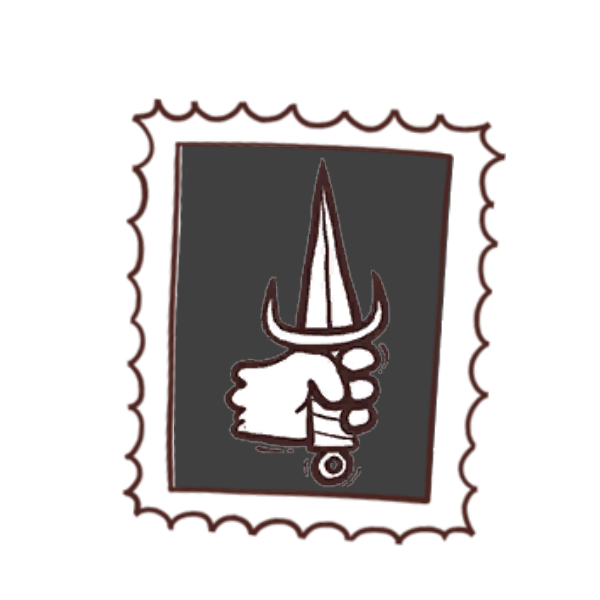 | 어중이떠중이 | [고립](#고립) 상태의 적을 공격할 때 [은신](#은신)을 얻습니다. [압도당함](#압도당함) 상태가 아니라면 기본 🔸이 1감소합니다. |

은신 능력을 이용해 피해없이 몬스터를 컷 할 수 있는 좋은 클래스입니다. 단, 첫 타에 처리하지 못하면 공격력이 감소되므로 전투가 힘들어집니다. **공격 후, 도망, 다시 공격** 을 잘 활용하셔야합니다.

#### 좋은 특성

| 이미지                                         | 이름   | 설명                                               |
| ---------------------------------------------- | ------ | -------------------------------------------------- |
|  | 모험가 | 소검, 사슬갑옷, 성냥을 가진채로 던전을 시작합니다. |

도적에게 필요한 모든것을 갖춘 특성입니다. 소검을 장착한 채, 은신으로 공격하면 5딜, 사슬갑옷은 공격력 2짜리 몬스터를 피해 없이 잡을 수 있게 해주고, 성냥은 조건부 3딜이나 적에게 연소를 부여해 원소술사 특성을 활성화 시키는 등 다재다능하게 이용할 수 있습니다.

| 이미지                                        | 이름     | 설명                                                        |
| --------------------------------------------- | -------- | ----------------------------------------------------------- |
|     | 양조사   | 물약을 획득할 때, 하나를 복사해 더 획득합니다.              |
| 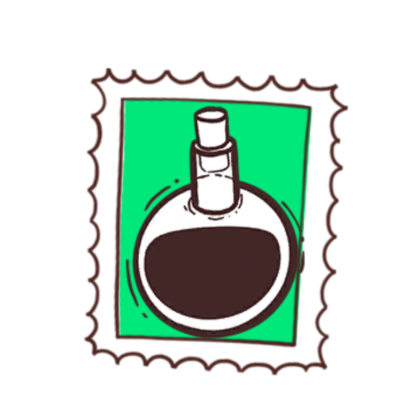 | 연금술사 | 던전을 시작할 때, 임의의 물약 3개를 복사해 덱에 추가합니다. |

양조사는 도적의 주 전략인 뇌물을 활용할 때, 드래고온의 금을 복사해 대량의 골드를 얻을 수 있게 해주는 특성입니다. 물론 회복물약만 복사해도 좋습니다.

연금술사는 드래고온의 금을 픽하지 못했을 때, 보험용으로 활용할 수 있습니다. 기본적으로 무난한 특성입니다.

| 이미지                                    | 이름 | 설명                                                                                           |
| ----------------------------------------- | ---- | ---------------------------------------------------------------------------------------------- |
|  | 냉기 | 전투마다 한 번, 상대가 행동하고나서, 그 행동에 🔸이 포함되어있다면 적을 [빙결](#빙결)시킵니다. |

첫 공격에 적을 죽이지 못하더라도 피해없이 도망칠 수 있게 해주는 아주 좋은 특성입니다.

| 이미지                                        | 이름      | 설명                                                     |
| --------------------------------------------- | --------- | -------------------------------------------------------- |
|    | 수집가    | 내 인벤토리에 4개의 타일이 있는 동안, 🔸이 1 증가합니다. |
|     | Sneaky    | 매 전투마다 내 첫 공격에, 🔸이 1 증가합니다.             |
| 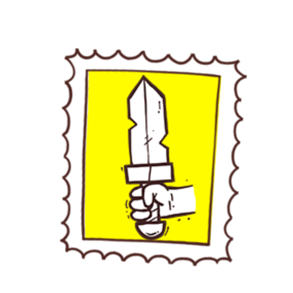 | Warmonger | 내가 근접 무기로 공격할 때, 🔸이 1 증가합니다.           |

공격력을 늘려주는 특성은 대부분 좋지만, 특히 위 세개가 좋습니다.

수집가는 거의 항상 좋습니다. 특히 [모험가](#Adventurer)와 같이 조합되면 극초반부터 효과를 볼 수 있습니다.

[Sneaky](#Sneaky)는 특별히 조건을 맞추지 않아도, 첫 [은신](#은신)공격에 적용되니 경우에따라 수집가보다 좋은 경우도 있습니다.

Warmonger는 근접 무기를 많이 이용하는 도적에게 아주 잘 어울립니다. 역시 [모험가](#Adventurer)와 조합하면 처음부터 [소검]()을 들고 6딜을 깔 수 있습니다.

#### 좋은 카드

| 이미지                                             | 이름          | 설명                                                              |
| -------------------------------------------------- | ------------- | ----------------------------------------------------------------- |
| 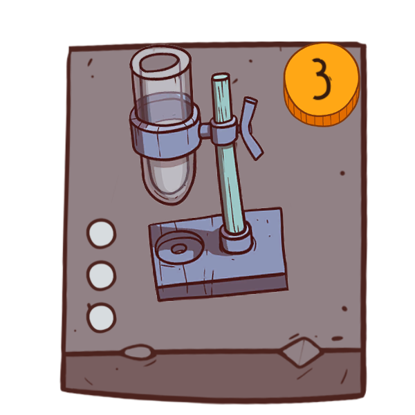 | 연금술 키트   | 무작위 물약을 [선발](#선발)합니다.                                |
| 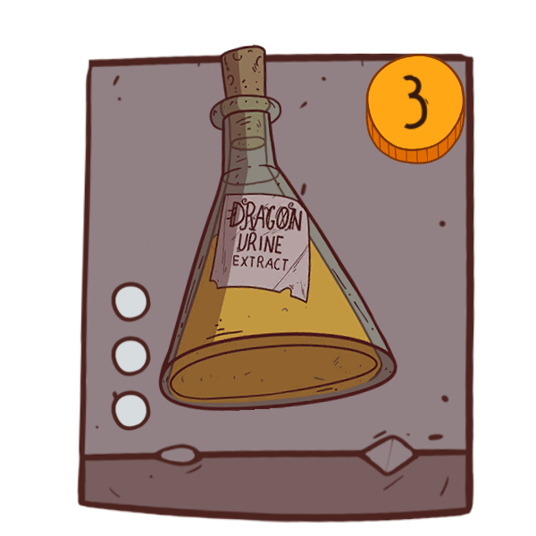    | 드래고온의 금 | 대상 아이템을 5💰로 변환시킵니다.                                 |
| 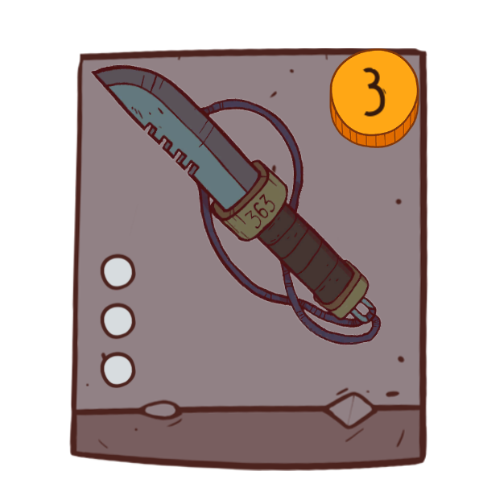    | 전투 단검     | 이 타일을 획득할 때, [찌르기](#찌르기)을 두 장 덱에 섞어넣습니다. |

골드는 도적의 핵심입니다. 저는 개인적으로 연금술 키트를 더 상급으로 칩니다. 결국 중요한건 드래고온의 금인데요, 잘 나오는 편입니다. 부수적으로 나오는 독 물약도 좋고, 아이템 변환 물약도 노려볼만한 아이템이 많습니다. 많이는 필요없고 덱에 1-2장 정도면 좋습니다. 아얘 없을경우, 조금 힘들정도로 필수 아이템 입니다.

전투 단검도 덱에 필수적인 경제 엔진입니다. 3💰를 내고 3킬을 할 수 있고, 덱에 섞여들어간 찌르기 두 장을 골드로 변환하면 2💰이득입니다. 덱에 많으면 많을수록 좋습니다.

| 이미지                                    | 이름 | 설명                                             |
| ----------------------------------------- | ---- | ------------------------------------------------ |
|  | 뇌물 | 4💰을 지불하여 보스가 아닌 대상 적을 처치합니다. |

도적의 알파이자 오메가 입니다. 드래고온의 금으로 골드를 많이 벌고, [쓰레기골렘](#쓰레기골렘)같이 처리가 어려운 적을 쉽게 처리할 수 있습니다. 적을 죽이면 1💰을 돌려주니 사실상 1킬에 3💰이 드는 셈입니다. 드래고온의 금 1장으로 5킬을 할 수 있는 셈이죠. 덱에 1장만 있으면 됩니다.

| 이미지                                        | 이름        | 설명                                                                                             |
| --------------------------------------------- | ----------- | ------------------------------------------------------------------------------------------------ |
| 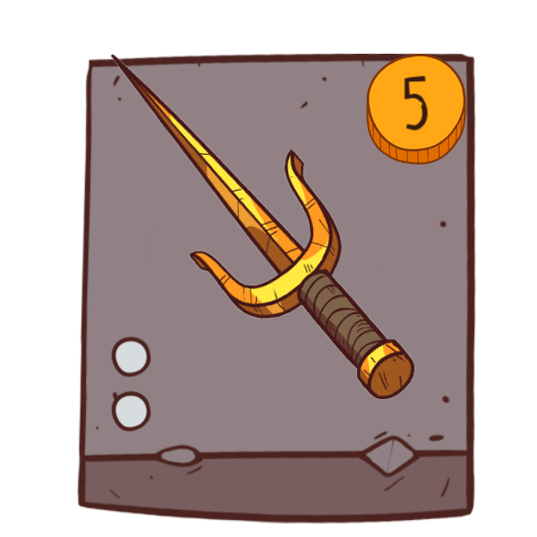 | 금도금 사이 | 이 무기를 획득하면, 한 장 더 복사하여 내 인벤토리에 추가합니다. 이 무기의 🔸은 내 💰와 같습니다. |

도적 전략의 핵심인 뇌물이 보스를 처리할 수 없다는 약점을 보완해주는 카드입니다. 서순이 중요한데요, 경제 엔진들로 골드를 최대한 모은 뒤, 금도금 사이를 이용해 보스를 처리한 후, 나머지 잡졸들을 뇌물로 처리하면 됩니다. 많이는 필요없고 1장이 필수입니다.

| 이미지                                         | 이름      | 설명                                                                            |
| ---------------------------------------------- | --------- | ------------------------------------------------------------------------------- |
| 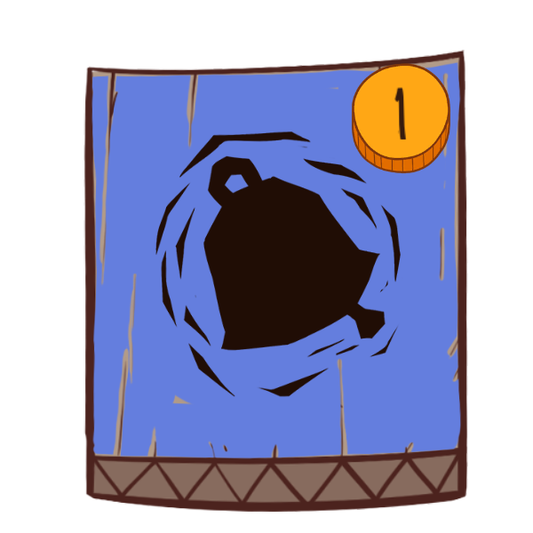 | 거짓 경보 | 모든 적을 덱에 다시 섞어넣습니다. 전투 중에는 사용할 수 없습니다. [소멸](#소멸) |

위기상황을 극복할 수 있게 해주는 감초 카드입니다. 보드에 적이 가득 찼을때 사용해 위기를 벗어나면서 필수 카드를 찾을 수 있게 해줍니다. 덱에 1-2장 넣을만합니다.

| 이미지                                          | 이름   | 설명                                                                                                          |
| ----------------------------------------------- | ------ | ------------------------------------------------------------------------------------------------------------- |
| 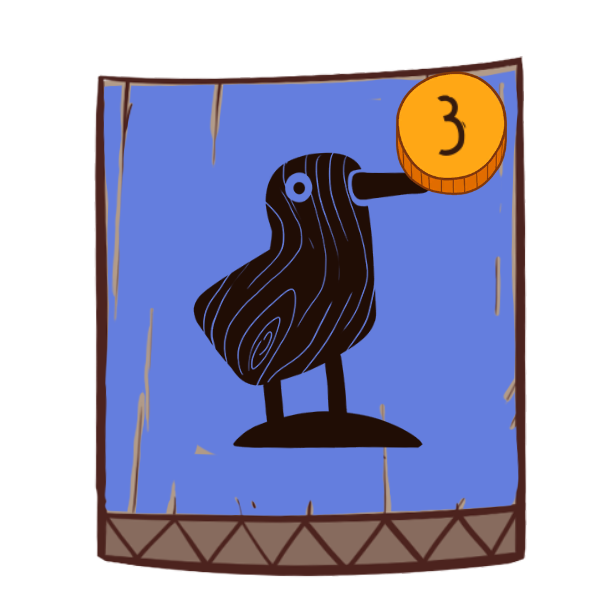 | 모조품 | 대상 아이템을 2장 복사하여 덱에 섞어 넣습니다. 복사한 타일들으 ㅣ내구도는 1이며 비용은 0입니다. [소멸](#소멸) |

금도금 사이를 복사하는데 사용합니다. 금도금 사이는 자체 복사 기능을 갖고있기때문에, 총 4장의 금도금 사이를 얻을 수 있습니다. 금도금 사이를 먼저 집고, 후속으로 1장 집어주면 좋습니다.

| 이미지                                            | 이름        | 설명                                                                                |
| ------------------------------------------------- | ----------- | ----------------------------------------------------------------------------------- |
| 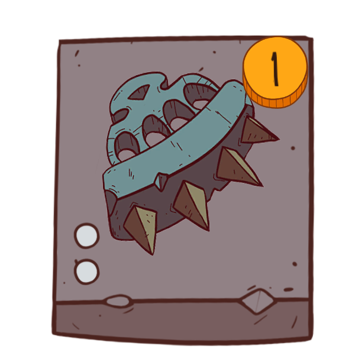 | 황동 너클   | 내 공격에 ⚡️[기습](#기습)이 있으면, 내가 공격한 뒤 상대를 [기절](#기절)시킵니다.   |
| 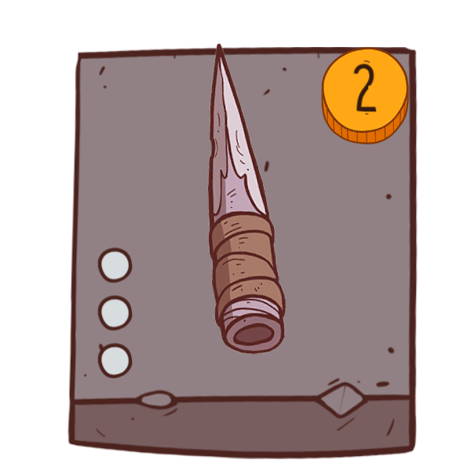    | 감옥 나이프 | [관통](#관통). ⚡️[기습](#기습). 내가 [은신](#은신)상태일 때 비용이 1💰 감소합니다. |
| 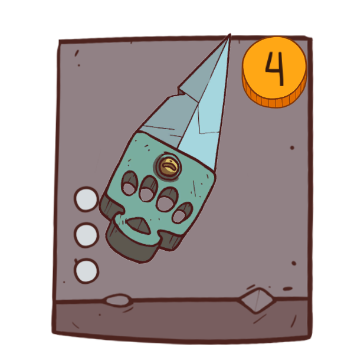     | 파쇄기      | [관통](#관통). 획득할 때 이 타일을 복사하여 인벤토리에 추가합니다.                  |

도적의 무기들 중, 경제성이 높은 무기들만 추려봤습니다.

황동 너클은 공격력이 낮지만, 피해없이 후속타를 쉽게 먹일 수 있게 해줍니다. 2마리 적을 죽인다면 마진 1💰가 생깁니다. 다다익선입니다.

감옥 나이프는 처리가 어려운 로봇류 적을 쉽게 죽일 수 있게 해줍니다. 비용대비 내구성도 좋습니다. 은신을 잘 활용하면 1💰에 3내구 무기를 얻을 수 있습니다. 개인적으로 오버스펙이라고 생각합니다. 다다익선.

파쇄기는 비싸보이지만, 자체 복사 능력을 갖고있으므로, 4원에 6내구입니다. 다만, 너무 비싸기때문에 1장정도가 적당합니다. 공격력도 준수하고, 관통 능력도 좋습니다.

| 이미지                                         | 이름          | 설명                                                                                                                                      |
| ---------------------------------------------- | ------------- | ----------------------------------------------------------------------------------------------------------------------------------------- |
| 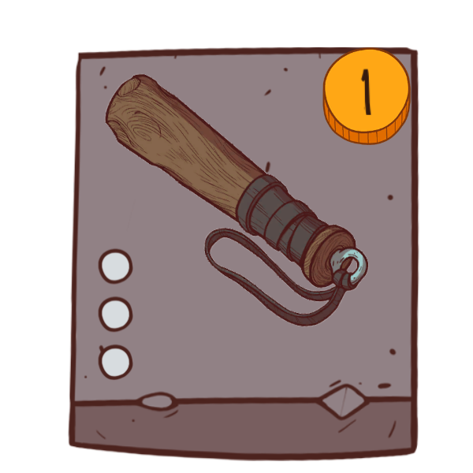  | 블랙잭        | 전투에서 대상 적을 [기절](#기절)시킵니다. [고립](#고립) 상태의 적에게만 사용할 수 있습니다. 이 타일을 획득할 때 [은신](#은신)을 얻습니다. |
| 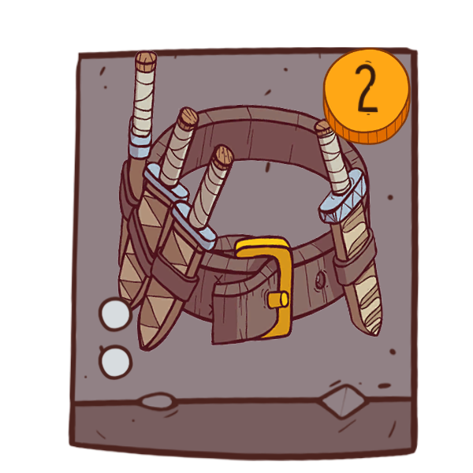 | 다용도 허리띠 | [독약병](#독약병), 블랙잭, 또는 [숨겨진 칼날](#숨겨진_칼날)타일을 [선발](#선발)합니다.                                                    |

블랙잭은 저렴한 비용으로 총 3번의 도주 기회를 제공해주는 훌륭한 도구입니다. 획득시 은신 기능으로, 나쁜 배치를 돌파할 수 있게 해주는것도 좋습니다.

다용도 허리띠는 블랙잭을 두번이나 뽑을 수 있게 해줍니다. 판에 따라 독약병을 가져오는 것도 도움이 됩니다. 숨겨진 칼날은 거의 뽑지 않습니다.

합쳐서 1장 정도 집어두면 든든합니다.

#### 도적의 전략

NG+8 난이도 까지 먹히는 가장 훌륭한 전략은 골드 전략입니다.

드래고온의 금으로 골드를 모으고, 뇌물로 잡졸을 제거, 금도금 사이로 보스를 제거하면 됩니다.

전투시 배치에 주의하세요. 고립 상태의 적이 없다면 게임이 어려워집니다.

### Muldorf(사령술사)

### Rose(사제)

## 키워드

<a name="고립">고립</a>: 같은 행에 다른 적 타일이 없는 적 타일

<a name="은신">은신</a>: 내 다음 공격이 [기습](#기습)을 갖고 +2 피해를 줍니다(무기가 있는 경우 +3)

<a name="기습">기습</a>: 기습 공격을 하는 캐릭터는 전투에서 항상 먼저 공격합니다. 두 캐릭터가 모두 기습을 가지고 있다면 영웅이 먼저 공격합니다.

<a name="압도당함">압도당함</a>: 이 효과는 보드에 6장 이상의 적이 있을 때 발동됩니다.

<a name="선발">선발</a>: 세 타일 중 하나를 선택하여 무료로 획득합니다.

<a name="소멸">소멸</a>: 이 타일은 사용 후 인벤토리에서 제거됩니다.

<a name="기절">기절</a>: 기절한 적들은 한 라운드의 행동 기회를 잃습니다. 적의 공격을 응수하거나, 특정한 능력을 통해 적을 기절시킬 수 있습니다.

<a name="관통">관통</a>: 관통 공격은 방어도와 방어구를 무시합니다.

